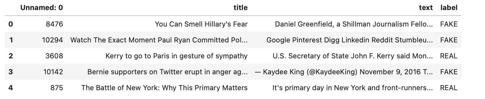
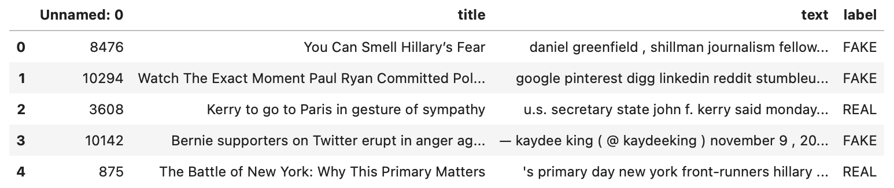
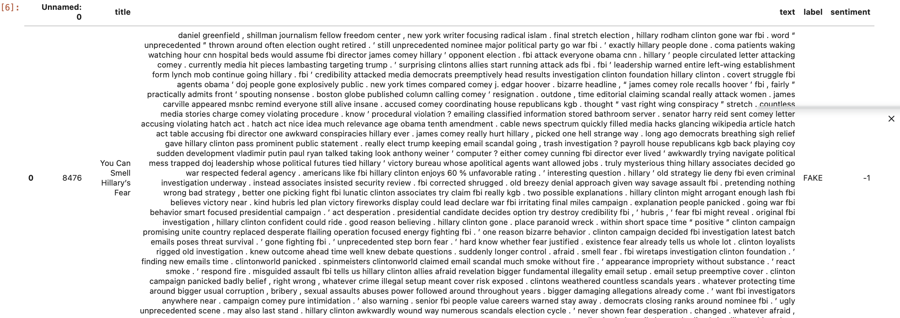
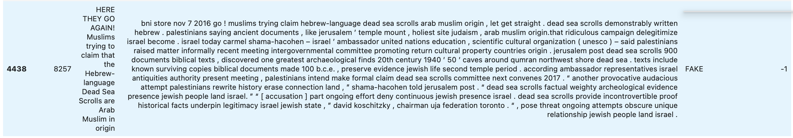

# SentimentClassifier
Creating a Naive Bayes Classifier to compute sentiment analysis on test data. Developed a corpus tokens from a real and fake news dataset. Each row was pre-processed using Tokenization, Lemmatization and Stemming. After pre-processing was complete, the data frame was split into 70% training and 30% test. Manual sentiment analysis was then performed on the training data, checking the polarity of each row, then assigning it a polarity score (1: Positive, 0: Neutral, -1: Negative). Multinomial Naive Bayes Classifier was then developed and used to perform sentiment analysis on the test data. 

# Built With
 
* Jupyter Notebook
* Libraries: NLTK, SKLearn, pandas, numpy
* Language: Python

# Examples

* 

* 

* 

* 

# License

This project is licensed under the MIT License - see the [LICENSE.md](LICENSE.md) file for details
